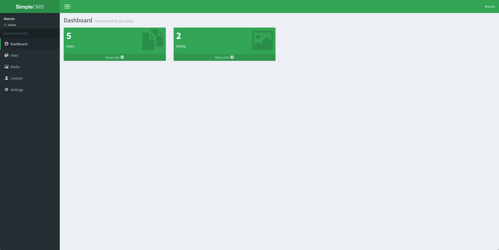
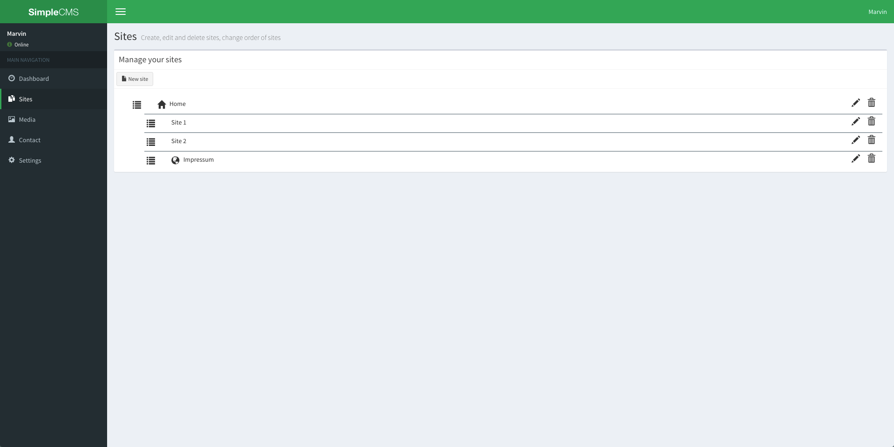
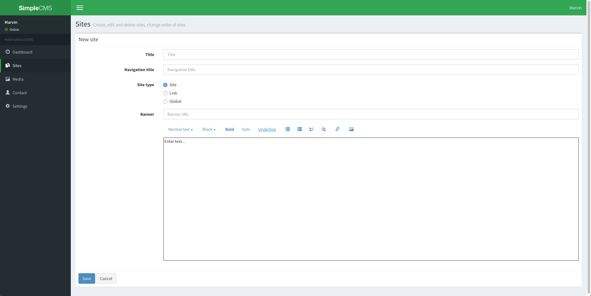
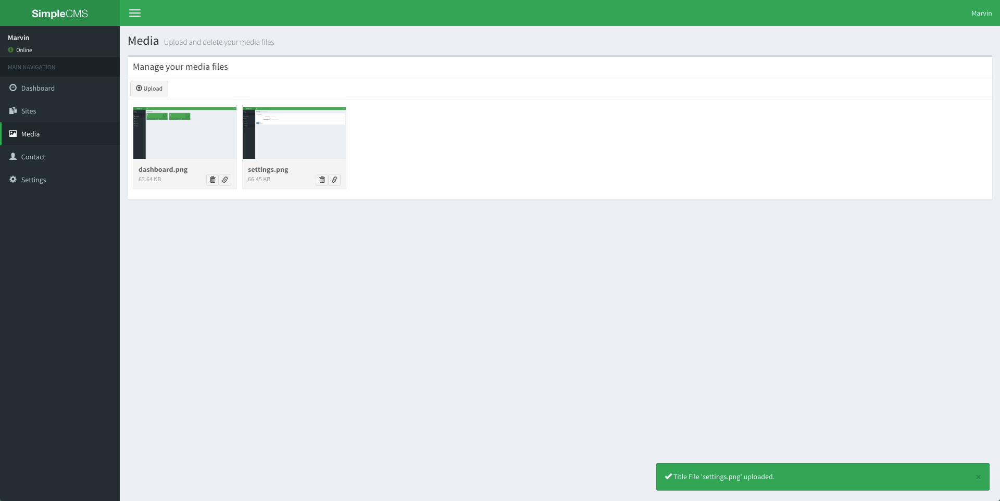
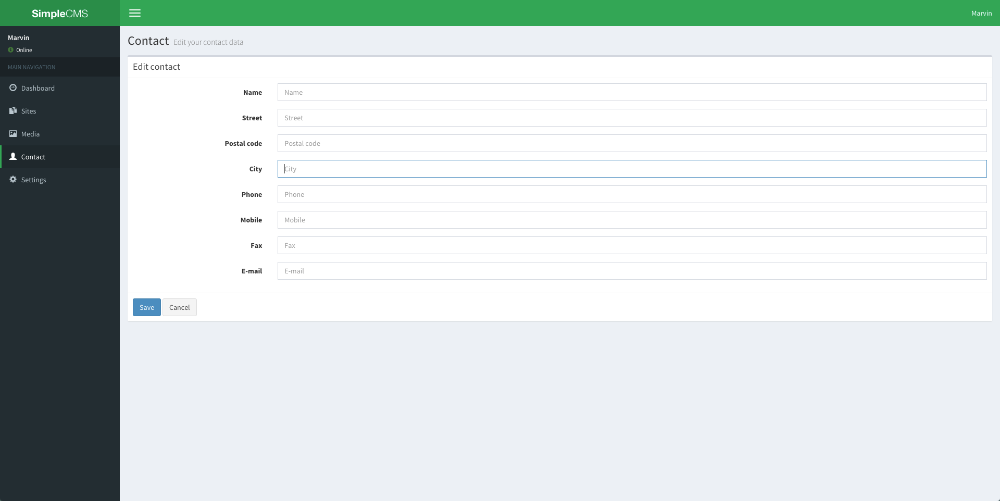
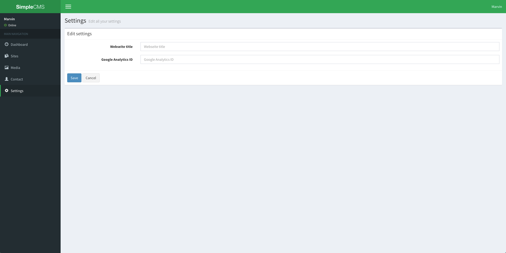
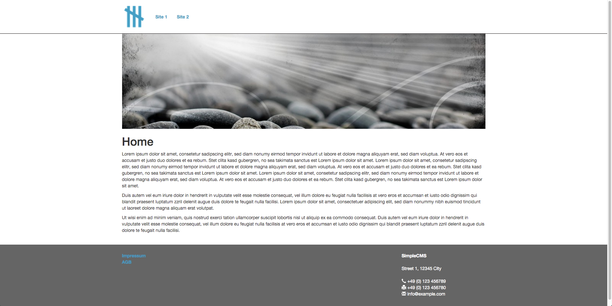

# Simple CMS for laravel 5

Simple CMS provides you to create small and simple cms pages.

## Installation

To install this laravel 5 packages add `mc388/simple-cms` to your `composer.json` and run `composer update`.

### Publish assets

To compile all sass files, you need to install npm first.
Then goto `src` folder and run `npm install --save`.
After installing all necessary node modules you can run `gulp` to generate a css file from all sass files and copy all js files.
Next step is to publish the compiled css file to make it available to the meta project.
Therefore run `php artisan vendor:publish --tag=public --force` in the meta project.

### Commands running on the laravel project root

- Publish assets, config and migrations: `php artisan vendor:publish --force`
- Migrate database: `php artisan migrate`
- Seed contact model: `php artisan db:seed --class="Mc388\SimpleCms\Database\Seeds\ContactSeeder"`
- Seed content model: `php artisan db:seed --class="Mc388\SimpleCms\Database\Seeds\ContentSeeder"`

If you receive a "class not found" error when running migrations, try running the `composer dump-autoload` command and re-issuing the migrate command.

## Usage

### Dashboard

The dashboard is available for logged in users under `manage/dashboard`.

### Sites

#### Index

On the sites overview you can change the order and nesting of sites by drag-and-drop.
Sites with a house icon in front are on the root.
You can have multiple root elements if you want to highlight different areas on the homepage.
Normally you should have just one root node.
Sites which have a globe in front are global sites, which are displayed on every site in the current root node.

#### Form

In the site form you have three different site types:

1. Site: a normal site
1. Link: a link to an existing page, e.g. you want so link to a contact page in different root nodes.
1. Global: a site which is a available on each site in a root node, e.g. the impressum.

### Media

In this section you can upload media files which can be included in the site content.

### Contact

Here you can import your contact data which can be shown in the footer of your homepage.

### Settings

In the settings you can set the page title and a google analytics id.

## Example

## Vendor

The following packages are used:
- [AdminLTE](https://almsaeedstudio.com/themes/AdminLTE/index2.html) for the admin theme
- [wysihtml](http://wysihtml.com/) for the sites editor
- [MobileDetect](https://github.com/serbanghita/Mobile-Detect) to detect mobile clients for the frontend navigation
